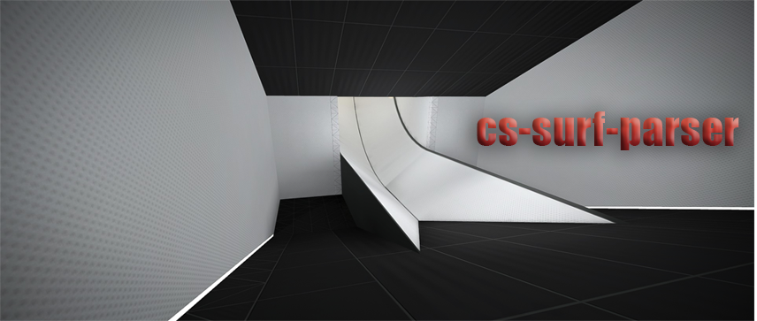

# Counter-Strike Surf Parser

## Table of Contents

- [Counter-Strike Surf Parser](#counter-strike-surf-parser)
  - [Introduction](#introduction)
  - [Features](#features)
  - [Prerequisites](#prerequisites)
  - [Installation](#Installation)
  - [Instructions](#instructions)
  - [License](#license)

## Introduction
Haven't you always wanted to neatly organize your Counter-Strike surf times? Well now you can! Counter-Strike Surf Parser is a handy Python script that allows you to parse and sort your Counter-Strike surf times with ease. The script offers three different sorting methods - Rank, Time, or Alphabetical Order of the map name. This allows you to have a concise and organized view of your best (or worst) surf times!

## Features
- **Efficient Parsing**: Efficiently parses your Counter-Strike surf times from your `console.log`.
- **Sorting**: Offers three different sorting methods for easy viewing:
  - Rank
  - Time
  - Alphabetical Order
- **Output**: Outputs the sorted data to a log file.

## Prerequisites
Before you begin, ensure you have met the following requirements:
* You have a `Windows/Linux/Mac` machine running [Python 3.5](https://www.python.org/downloads/) or later.
  * When installed choosing `ADD TO PATH` is recommended.
* Your Counter-Strike `console.log` file is updated with your latest surf times.

## Installation
* Download the latest release and extract to a folder of your choosing
   
  **OR**
   
* Clone the repository using `git clone https://github.com/Ahrimdon/cs-surf-parser.git`

## Instructions
Follow the steps below to use the Counter-Strike Surf Parser:

#### **Using the Python Script**
1. **Step 1**: Change `Enable Developer Console (~)` to `Yes` and type `con_logfile console.log`
      * Your can add this to your `autoexec.cfg` to log the console automatically
2. **Step 2**: In game, use the command to display your rank (e.g. !rank), select your Name and then select `Finished Maps`. This will print your finished maps to the console as well as output it to the log file
3. **Step 3**: Open your `console.log` (usually C:/SteamLibrary/steamapps/common/Counter-Strike Global Offensive/csgo/console.log), and copy **ONLY** your completed surf maps into a new file named `surf_maps.log`
4. **Step 4**: Make sure both `parsee_surf_maps.py` and `surf_maps.log` are in the same directory. Navigate to the folder in Terminal (e.g. `cd C:/path/to/folder`) and use the command `python parse_surf_maps.py`. Select the desired method of sorting.
5. **Step 5**: Your parsed and sorted maps will be in a new file named `parsed_surf_maps.log`

#### **Using the Executable**
1. **Step 1**: Change `Enable Developer Console (~)` to `Yes` and type `con_logfile console.log`
      * Your can add this to your `autoexec.cfg` to log the console automatically
2. **Step 2**: In game, use the command to display your rank (e.g. !rank), select your Name and then select `Finished Maps`. This will print your finished maps to the console as well as output it to the log file
3. **Step 3**: Open your `console.log` (usually C:/SteamLibrary/steamapps/common/Counter-Strike Global Offensive/csgo/console.log), and copy **ONLY** your completed surf maps into a new file named `surf_maps.log`
4. **Step 4**: Make sure the executable `parse_surf_maps.exe` is in the same directory as your `surf_maps.log` and run it. Select the desired method of sorting.
5. **Step 5**: Your parsed and sorted maps will be in a new file named `parsed_surf_maps.log`

## License
Distributed under the MIT License. See `LICENSE` for more information.
